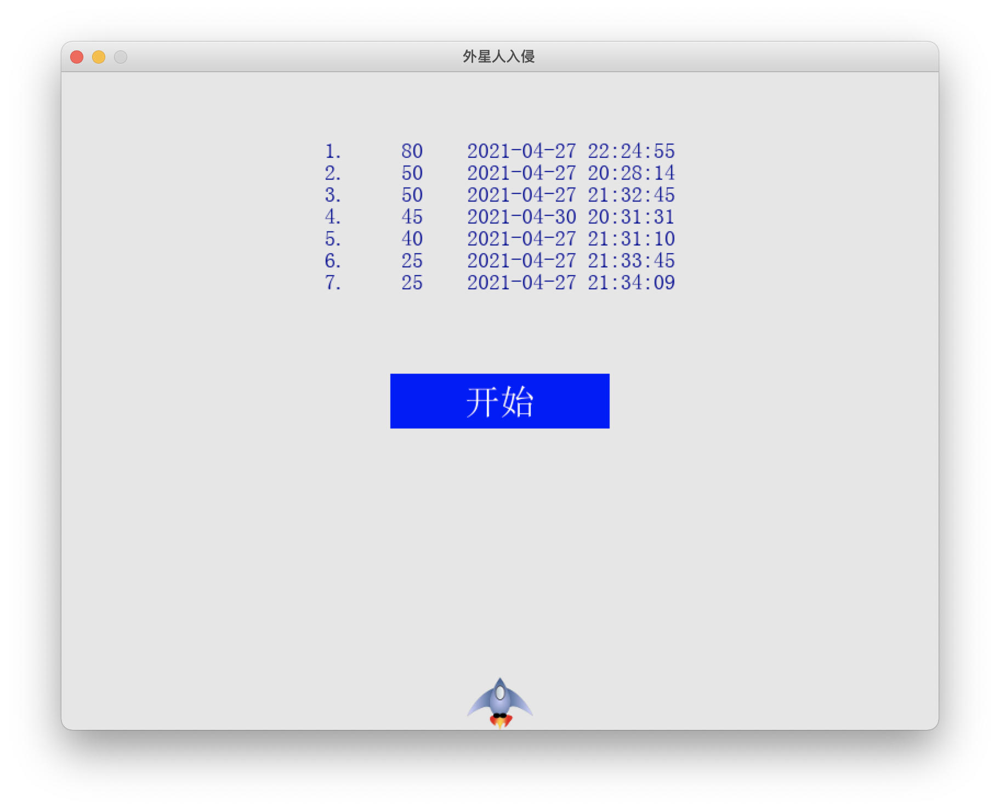
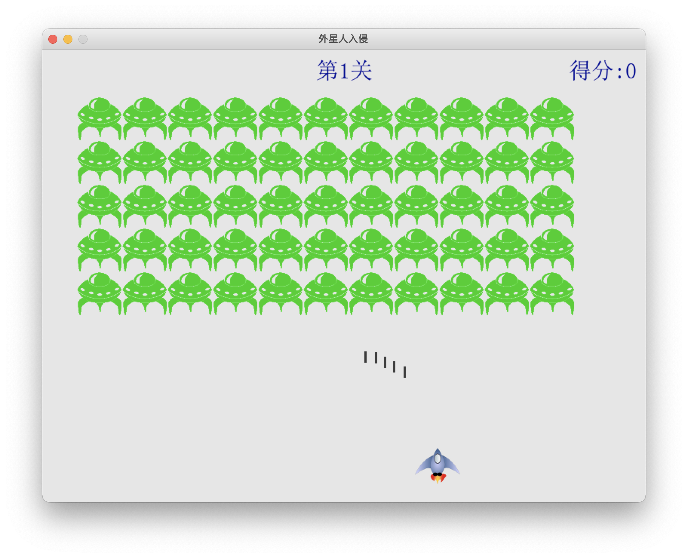

# Alien Invasion

[TOC]

## 0. 2021年《嵌入式系统与应用》大作业

### 0.1. 大作业目的

1. 熟悉和掌握树莓派环境配置和文件共享
2. 熟悉和掌握python面向对象程序设计
3. 熟悉和掌握python第三方模块调用
4. 熟悉和掌握树莓派PIO接口程序设计
5. 熟悉和掌握树莓派扩展ADC模数转换

### 0.2. 大作业要求

用python设计一个射击类游戏，要求装备、攻击物、目标、记分牌、界面和游戏整体都使用类方式OOP设计（推荐pygame），有良好的用户界面（推荐tkinter等），有游戏参数（比如地图、敌人行动速度、子弹数量等）和游戏升级功能（改变部分参数），有记分牌和记录存储功能，有多媒体动画或影音效果（外部文件）。

### 0.3. 游戏实例

一个上世纪DOS时代古老的小蜜蜂游戏《外星人入侵》，游戏用Python重写，在Windows平台下运行，比较完整的游戏实例已经编译成.EXE可执行文件的方式放在学在浙大上。课程将提供此游戏的类定义（.py文件）极简版的python源码和用到的图片声音等资源（dir下）：略

### 0.4. 大作业计分指南

- 基础要求：
    - 在源代码上做修改，让游戏具一定的人机互动功能
    - 在源代码上做修改，让类角色能在场景中简单移动
    - 在源代码上做修改，控制子弹出膛和在边界上消失
    - 在源代码上做修改，保存最高分，并在重启时读入
- 拓展要求：
    - 修改程序，通过游戏摇杆控制我角色在屏幕上移动
    - 修改程序，让敌角色能适应场景循环移动和下降
    - 修改程序，处理子弹与敌角色碰撞后消失和记分
    - 修改程序，游戏能够升级和改变角色运动参数
    - 修改程序，使游戏具有较好的影音用户体验
- 提高要求：
    - 敌角色有小概率规避子弹和吞吃子弹
    - 打到敌角色后有一定概率得到bonus奖励
    - 逼真的游戏效果和良好的用户体验


## 1. Requirements

### 1.1. Requirements on Windows/MacOS

- Python 3.7.3
- Pygame 1.9.6

### 1.2. Requirements on RaspberryPi

- Python 3.7.3
- Pygame 1.9.4.post1


## 2. File structure

### 2.1. Windows/MacOS

- <dir>alien_key</dir>
    - `alien.py`
    - `board.py`
    - `bullet.py`
    - `button.py`
    - `game.py`
    - <dir>images</dir>
        - alien.bmp
        - ship.bmp
    - `invasion.py`
    - <dir>others</dir>
        - `records.txt` (will be saved here)
        - `simsun.ttc`
    - `settings.py`
    - `ship.py`
    - <dir>sound</dir>
        - `bomb.wav`
        - `gameover.ogg`
        - `go.ogg`
        - `levelup.ogg`
        - `newhighscore.ogg`
        - `ready.ogg`
        - `shoot.wav`

### 2.2. RaspberryPi

- <dir>alien_key</dir>
    - `alien.py`
    - `board.py`
    - `bullet.py`
    - `button.py`
    - `game.py`
    - <dir>images</dir>
        - alien.bmp
        - ship.bmp
    - `invasion.py`
    - `joystick.py`
    - <dir>others</dir>
        - `records.txt` (will be saved here)
        - `simsun.ttc`
    - `PCF8591.py`
    - `settings.py`
    - `ship.py`
    - <dir>sound</dir>
        - `bomb.wav`
        - `gameover.ogg`
        - `go.ogg`
        - `levelup.ogg`
        - `newhighscore.ogg`
        - `ready.ogg`
        - `shoot.wav`


## 3. Codes

### 3.0. Codes in common

#### 3.0.1. `alien.py`

Definition of `Alien` object. 

```python
import os
import pygame
from pygame.sprite import Sprite

class Alien(Sprite):
    def __init__(self):
        super().__init__()
        self.image = pygame.image.load(os.path.join('.','images','alien.bmp'))
        self.rect = self.image.get_rect()
        self.rect.x = self.rect.width
        self.rect.y = self.rect.height

    def reach_edge(self, game):
        if (self.rect.right > game.settings.screen_width) or (self.rect.left < 0):
            return True
        else:
            return False

    def update(self, game): 
        #self.rect.x += int(game.settings.fleet_direction * game.roundboard.Round * 0.2)
        self.rect.x += game.settings.fleet_direction
```

#### 3.0.2. `board.py`

Definitions of three boards -- `Scoreboard`, `Roundboard` and `Topboard`. 

```python
import os
import pygame
```

##### a. `Scoreboard`

Display scores in the game. 

```python
class Scoreboard():
    def __init__(self, game):       
        self.font = pygame.font.Font(os.path.join('.','others','simsun.ttc'),30)
        self.reset(game)        

    def reset(self, game):
        self.score = 0        
        self.update(game)
    
    def update(self, game):        
        score = "得分:{:,}".format(self.score)
        self.score_ = self.font.render(score, True, (0,0,150), game.settings.bg_color)                                
        self.score_rect = self.score_.get_rect()
        self.score_rect.right = game.screen.get_rect().right - 0.02 * game.settings.screen_height
        self.score_rect.top = game.screen.get_rect().top + 0.02 * game.settings.screen_height
    
    def show(self, screen):
        screen.blit(self.score_, self.score_rect)
```

##### b. `Roundboard`

Show current rounds in the game. 

```python
class Roundboard():
    def __init__(self, game):       
        self.font = pygame.font.Font(os.path.join('.','others','simsun.ttc'),30)
        self.reset(game)        

    def reset(self, game):
        self.Round = 1
        self.update(game)
    
    def update(self, game):        
        Round = "第{:,}关".format(self.Round)
        self.Round_ = self.font.render(Round, True, (0,0,150), game.settings.bg_color)                                
        self.Round_rect = self.Round_.get_rect()
        self.Round_rect.center = game.screen.get_rect().center
        self.Round_rect.top = game.screen.get_rect().top + 0.02 * game.settings.screen_height
    
    def show(self, screen):
        screen.blit(self.Round_, self.Round_rect)
```

##### c. `Topboard`

Show top scores on the start page. 

```python
class Topboard():
    def __init__(self, game):       
        self.font = pygame.font.Font(os.path.join('.','others','simsun.ttc'),20)
        self.reset(game)        

    def reset(self, game):
        self.update(game)
    
    def update(self, game):
        tops = []
        try:
            with open(os.path.join('.','others','records.txt'), 'r') as file:
                content = file.readlines()
            for c in content:
                time, score = c.split('\t')
                tops.append((score, time))
        except FileNotFoundError:
            pass

        self.tops_ = []
        self.tops_rect = []
        for itop, top in enumerate(tops):
            if itop < 7:
                score, time = top
                t = str(itop+1) + '.' + (9-len(str(itop+1))-len(score))*' ' + score + '\t' + time
                top_ = self.font.render(t, True, (0,0,150), game.settings.bg_color)
                top_rect = top_.get_rect()
                top_rect.center = game.screen.get_rect().center
                top_rect.top = game.screen.get_rect().top + 20 * itop + 0.1 * game.settings.screen_height
                self.tops_.append(top_)
                self.tops_rect.append(top_rect)
    
    def show(self, screen):
        for i in range(len(self.tops_)):
            screen.blit(self.tops_[i], self.tops_rect[i])
```

#### 3.0.3. `bullet.py`

Definition of `Bullet` object. 

```python
import pygame
from pygame.sprite import Sprite

class Bullet(Sprite):
    def __init__(self, game):
        super().__init__()
        self.rect = pygame.Rect(0, 0, 3, 15)
        self.rect.centerx = game.ship.rect.centerx
        self.rect.top = game.ship.rect.top

    def update(self, game):
        self.rect.y -= 1
    
    def blitme(self, game):
        pygame.draw.rect(game.screen, (60,60,60), self.rect)
```

#### 3.0.4. `button.py`

Definition of `Button` object. 

```python
import os
import pygame.font

class Button():    
    def __init__(self, game, msg):        
        self.font = pygame.font.Font(os.path.join('.','others','simsun.ttc'),32)

        # 按钮矩形
        self.rect = pygame.Rect(0, 0, 200, 50)
        self.rect.center = game.screen.get_rect().center
        # 按钮文字
        self.msg = msg
        self.text = self.font.render(msg, True, (255,255,255), (0, 0, 255))
        self.text_rect = self.text.get_rect()
        self.text_rect.center = self.rect.center
    
    def draw(self, game):
        # 画背景
        game.screen.fill((0, 0, 255), self.rect)
        # 画背景之上的图片
        game.screen.blit(self.text, self.text_rect)
```

#### 3.0.5. `invasion.py`

Main file of the game. 

> Note: `game.py` is different between PC version and Pi version, so you can find it below. 

```python
from game import Game

def run_game():
    
    game = Game()    
    while True:
        game.check_events()
        if game.game_active:
            game.update_sprites()
        game.update_screen()

if __name__ == '__main__':
    run_game()
```

#### 3.0.6. `settings.py`

Basic settings of the game. 

```python
class Settings():
    def __init__(self, w=800, h=600, c=(230, 230, 230)):
        self.screen_width = w
        self.screen_height = h
        self.fleet_direction = 1
        self.bg_color = c
```

#### 3.0.7. `ship.py`

Definition of `Ship` object. 

```python
import os
import pygame
from pygame.sprite import Sprite

class Ship(Sprite):
    def __init__(self, game):
        super().__init__()
        self.screen = game.screen
        self.image = pygame.image.load(os.path.join('.','images','ship.bmp'))
        self.rect = self.image.get_rect()
        self.place_center()
        self.movingx = 0
        self.movingy = 0
        self.speed = 2
    
    def blitme(self):
        self.screen.blit(self.image, self.rect)
    
    def update(self):        
        if (not self.movingx==0) and (0 < self.rect.centerx+self.movingx*(self.rect.width/2+self.speed) < self.screen.get_rect().right):
            self.rect.centerx += self.movingx*self.speed
        if (not self.movingy==0) and (0 < self.rect.centery+self.movingy*(self.rect.height/2+self.speed) < self.screen.get_rect().bottom):
            self.rect.centery += self.movingy*self.speed
    
    def place_center(self):
        self.rect.centerx = self.screen.get_rect().centerx
        self.rect.bottom = self.screen.get_rect().bottom            
```

### 3.1. Codes on Windows/MacOS

#### 3.1.1 `game.py`

Definition of `Game` object. All logic's here. 

```python
import os
import sys
import pygame
from pygame.sprite import Group
from datetime import datetime as dt
from queue import PriorityQueue as PQ

from setting import Settings
from ship import Ship
from bullet import Bullet
from alien import Alien
from button import Button
from board import Scoreboard, Roundboard, Topboard

class Game():
    def __init__(self):
        pygame.init()
        self.settings = Settings()        
        self.game_active = False        
        self.screen = pygame.display.set_mode((self.settings.screen_width,self.settings.screen_height))
        pygame.display.set_caption("外星人入侵")
        self.ship = Ship(self)
        self.ship_left = 1
        self.scoreboard = Scoreboard(self)
        self.roundboard = Roundboard(self)
        self.topboard = Topboard(self)
        self.bullets = Group()
        self.aliens = Group()
        self.button = Button(self,'开始')
        self.reset_level()

        pygame.mixer.init()
        pygame.mixer.music.load(os.path.join('.','sound','ready.ogg'))
        pygame.mixer.music.set_volume(0.7)
        pygame.mixer.music.play()
        self.sounds = {}
        self.sounds['bomb'] = pygame.mixer.Sound(os.path.join('.','sound','bomb.wav'))
        self.sounds['shoot'] = pygame.mixer.Sound(os.path.join('.','sound','shoot.wav'))
        self.sounds['bomb'].set_volume(0.7)
        self.sounds['shoot'].set_volume(0.7)

        try:
            with open(os.path.join('.','others','records.txt'), 'r') as file:
                content = file.readlines()
            time, score = content[0].split('\t')
            self.highest = int(score)
        except FileNotFoundError:
            self.highest = 0

    def reset_level(self):        
        self.bullets.empty()
        self.aliens.empty()
        self.create_fleet()
        self.ship.place_center()
    
    def next_level(self):
        self.roundboard.Round += 1
        self.roundboard.update(self)
        self.ship.speed += 0.1
        self.reset_level()

    def check_events(self):
        for event in pygame.event.get():
            if event.type == pygame.QUIT:
                self.QUIT_GAME()
            elif event.type == pygame.KEYDOWN:
                self.check_keydown(event.key)
            elif event.type == pygame.KEYUP:
                self.check_keyup(event.key)
            elif event.type == pygame.MOUSEBUTTONDOWN:
                self.check_button(self.button)

    def check_button(self,button):
        mouse = pygame.mouse.get_pos()                        
        if button.msg == '开始':
            self.game_active = True
            self.settings = Settings()
            self.ship_left = 1
            self.scoreboard.reset(self)
            self.roundboard.reset(self)
            self.reset_level()
            pygame.mixer.music.load(os.path.join('.','sound','go.ogg'))
            pygame.mixer.music.set_volume(0.7)
            pygame.mixer.music.play()
        elif button.msg == '结束':
            self.game_active = False
            self.settings = Settings()
            self.ship_left = 1
            self.scoreboard.reset(self)
            self.roundboard.reset(self)
            self.reset_level()
            self.button = Button(self,'开始')
            self.button.draw(self)
        
    def check_keydown(self,key):
        if key == pygame.K_LEFT:
            self.ship.movingx = -1
        elif key == pygame.K_RIGHT:
            self.ship.movingx = 1
        elif key == pygame.K_UP:
            self.ship.movingy = -1
        elif key == pygame.K_DOWN:
            self.ship.movingy = 1
        elif key == pygame.K_SPACE:
            if len(self.bullets) < 4 + self.roundboard.Round:
                self.sounds['shoot'].play()
                bullet = Bullet(self)
                self.bullets.add(bullet)

    def check_keyup(self,key):
        if key == pygame.K_q:
            if self.game_active:
                self.save_records()
                self.__init__()
            else:
                self.QUIT_GAME()
        elif key == pygame.K_LEFT and self.ship.movingx == -1:
            self.ship.movingx = 0
            if pygame.key.get_pressed()[pygame.K_RIGHT]: # more smoothly
                self.ship.movingx = 1
        elif key == pygame.K_RIGHT and self.ship.movingx == 1:
            self.ship.movingx = 0
            if pygame.key.get_pressed()[pygame.K_LEFT]:
                self.ship.movingx = -1
        elif key == pygame.K_UP and self.ship.movingy == -1:
            self.ship.movingy = 0
            if pygame.key.get_pressed()[pygame.K_DOWN]:
                self.ship.movingy = 1
        elif key == pygame.K_DOWN and self.ship.movingy == 1:
            self.ship.movingy = 0
            if pygame.key.get_pressed()[pygame.K_UP]:
                self.ship.movingx = -1

    def update_screen(self):
        self.screen.fill(self.settings.bg_color)
        for bullet in self.bullets.sprites():
            bullet.blitme(self)
        self.ship.blitme()
        if self.game_active:
            self.aliens.draw(self.screen)
            self.scoreboard.show(self.screen)
            self.roundboard.show(self.screen)
        else:
            self.topboard.show(self.screen)
        if self.ship_left < 1 :
            self.game_active = False
        if not self.game_active:
            self.button.draw(self)
        pygame.display.update()

    def update_sprites(self): 
        self.ship.update()        
        self.update_aliens()
        self.update_bullets()
        self.check_alien_bullet_collision()
        self.check_alien_ship_collision()
        self.check_alien_bottom_collision()

    def update_bullets(self):
        self.bullets.update(self)
        for bullet in self.bullets.copy():
            if bullet.rect.bottom < 0:
                self.bullets.remove(bullet)  

    def check_alien_bullet_collision(self):
        collisions = pygame.sprite.groupcollide(self.aliens,self.bullets,True,True)
        if collisions:
            self.sounds['bomb'].play()
            for alien in collisions.values():
                self.scoreboard.score += 5*len(alien)
                if self.scoreboard.score > self.highest:
                    pygame.mixer.music.load(os.path.join('.','sound','newhighscore.ogg'))
                    pygame.mixer.music.set_volume(0.7)
                    pygame.mixer.music.play()
                    self.highest = 1e18
                self.scoreboard.update(self)
        if len(self.aliens) == 0:
            pygame.mixer.music.load(os.path.join('.','sound','levelup.ogg'))
            pygame.mixer.music.set_volume(0.7)
            pygame.mixer.music.play()
            self.next_level()
    
    def create_alien(self,col_number,row_number):
        alien = Alien()
        alien.rect.x = alien.x = alien.rect.width + alien.rect.width * col_number
        alien.rect.y = alien.rect.height + alien.rect.height * row_number
        self.aliens.add(alien)
        
    def create_fleet(self):
        alien = Alien()
        fleet_cols = self.get_fleet_cols(self.settings.screen_width,alien.rect.width)
        fleet_rows = self.get_fleet_rows(self.settings.screen_height,alien.rect.height)
        
        for row in range(fleet_rows):
            for col in range(fleet_cols):
                self.create_alien(col,row)
                
    def get_fleet_cols(self,screen_width,width):
        space_x = screen_width - 2 * width
        return int(space_x/width)

    def get_fleet_rows(self,screen_height,height):
        space_y = screen_height - 5 * height
        return int(space_y/height)

    def update_aliens(self):
        self.aliens.update(self)
        self.check_fleet_edge()               
        
    def check_fleet_edge(self):
        for alien in self.aliens.copy():
            if alien.reach_edge(self):
                self.settings.fleet_direction *= -1
                for a in self.aliens:                
                    a.rect.y += (5 + 0.8*self.roundboard.Round)
                break
            
    def lose_aship(self):
        self.ship_left -= 1
        if self.ship_left < 1:
            pygame.time.wait(500)           
            self.button = Button(self,'结束')
            pygame.mixer.music.load(os.path.join('.','sound','gameover.ogg'))
            pygame.mixer.music.set_volume(0.7)
            pygame.mixer.music.play()
        else:                
            self.reset_level()
        self.save_records()
            
    def check_alien_ship_collision(self):
        if pygame.sprite.spritecollideany(self.ship,self.aliens):
            self.sounds['bomb'].play()
            self.lose_aship()
            
    def check_alien_bottom_collision(self):
        screen_rect = self.screen.get_rect()
        for alien in self.aliens:
            if alien.rect.bottom >= screen_rect.bottom:              
                self.lose_aship()
                break

    def save_records(self):
        records = PQ()
        # `record.txt` format: %Y-%m-%d %H:%M:%S\tScore
        # 如果有旧的文件
        if os.path.exists(os.path.join('.','others','records.txt')):
            with open(os.path.join('.','others','records.txt'), 'r') as file:
                content = file.readlines()
            for c in content:
                time, score = c.split('\t')
                score = int(score)
                records.put((-score, time))
        # 读取新纪录
        newRecord = self.scoreboard.score
        newTime = dt.now().strftime('%Y-%m-%d %H:%M:%S')
        records.put((-newRecord, newTime))
        # 写入新纪录
        with open(os.path.join('.','others','records.txt'), 'w') as file:
            while not records.empty():
                score, time = records.get()
                score = str(-score)
                file.write(time+'\t'+score+'\n')

    def QUIT_GAME(self):
        pygame.quit()
        sys.exit()
```

### 3.2. Codes on RaspberryPi

#### 3.2.1 `game.py`

Definition of `Game` object. All logic's here. 

```python
import os
import sys
import pygame
from pygame.sprite import Group
from datetime import datetime as dt
from queue import PriorityQueue as PQ

from setting import Settings
from ship import Ship
from bullet import Bullet
from alien import Alien
from button import Button
from board import Scoreboard, Roundboard, Topboard

import PCF8591 as ADC
from joystick import js_msg, detect_js

class Game():
    def __init__(self):
        ADC.setup(0x48)

        pygame.init()
        self.settings = Settings()        
        self.game_active = False        
        self.screen = pygame.display.set_mode((self.settings.screen_width,self.settings.screen_height))
        pygame.display.set_caption("外星人入侵")
        self.ship = Ship(self)
        self.ship_left = 1
        self.scoreboard = Scoreboard(self)
        self.roundboard = Roundboard(self)
        self.topboard = Topboard(self)
        self.bullets = Group()
        self.aliens = Group()
        self.button = Button(self,'开始')
        self.reset_level()

        pygame.mixer.init()
        pygame.mixer.music.load(os.path.join('.','sound','ready.ogg'))
        pygame.mixer.music.set_volume(0.7)
        pygame.mixer.music.play()
        self.sounds = {}
        self.sounds['bomb'] = pygame.mixer.Sound(os.path.join('.','sound','bomb.wav'))
        self.sounds['shoot'] = pygame.mixer.Sound(os.path.join('.','sound','shoot.wav'))
        self.sounds['bomb'].set_volume(0.7)
        self.sounds['shoot'].set_volume(0.7)

        try:
            with open(os.path.join('.','others','records.txt'), 'r') as file:
                content = file.readlines()
            time, score = content[0].split('\t')
            self.highest = int(score)
        except FileNotFoundError:
            self.highest = 0

    def reset_level(self):        
        self.bullets.empty()
        self.aliens.empty()
        self.create_fleet()
        self.ship.place_center()
        self.ship.movingx = 0
        self.ship.movingy = 0
    
    def next_level(self):
        self.roundboard.Round += 1
        self.roundboard.update(self)
        self.ship.speed += 0.1
        self.reset_level()

    def check_events(self):
        for event in pygame.event.get():
            if event.type == pygame.QUIT:
                self.QUIT_GAME()
            elif event.type == pygame.KEYUP:
                self.check_keyup(event.key)
            elif event.type == pygame.MOUSEBUTTONDOWN:
                self.check_button(self.button)
        if self.game_active:
            self.stick2key()

    def check_button(self,button):
        mouse = pygame.mouse.get_pos()                        
        if button.msg == '开始':
            self.game_active = True
            self.settings = Settings()
            self.ship_left = 1
            self.scoreboard.reset(self)
            self.roundboard.reset(self)
            self.reset_level()
            pygame.mixer.music.load(os.path.join('.','sound','go.ogg'))
            pygame.mixer.music.set_volume(0.7)
            pygame.mixer.music.play()
        elif button.msg == '结束':
            self.game_active = False
            self.settings = Settings()
            self.ship_left = 1
            self.scoreboard.reset(self)
            self.roundboard.reset(self)
            self.reset_level()
            self.button = Button(self,'开始')
            self.button.draw(self)

    def stick2key(self):
        """Convert stick info to key info
        """
        def left():
            self.ship.movingx = -1
        def right():
            self.ship.movingx = 1
        def up():
            self.ship.movingy = -1
        def down():
            self.ship.movingy = 1
        def attack():
            if len(self.bullets) < 4 + self.roundboard.Round:
                self.sounds['shoot'].play()
                bullet = Bullet(self)
                self.bullets.add(bullet)
        state = detect_js()
        #state =      0     1     2      3      4        5
        #js_msg = ['home','up','down','left','right','pressed']
        switch = {
            'home':    None,
            'up':      up,
            'down':    down,
            'left':    left,
            'right':   right,
            'pressed': attack
            }
        action = switch[js_msg[state]]
        if not action is None:
            action()

    def check_keyup(self,key):
        if key == pygame.K_q:
            if self.game_active:
                self.save_records()
                self.__init__()
            else:
                self.QUIT_GAME()

    def update_screen(self):
        self.screen.fill(self.settings.bg_color)
        for bullet in self.bullets.sprites():
            bullet.blitme(self)
        self.ship.blitme()
        if self.game_active:
            self.aliens.draw(self.screen)
            self.scoreboard.show(self.screen)
            self.roundboard.show(self.screen)
        else:
            self.topboard.show(self.screen)
        if self.ship_left < 1 :
            self.game_active = False
        if not self.game_active:
            self.button.draw(self)
        pygame.display.update()

    def update_sprites(self): 
        self.ship.update()        
        self.update_aliens()
        self.update_bullets()
        self.check_alien_bullet_collision()
        self.check_alien_ship_collision()
        self.check_alien_bottom_collision()

    def update_bullets(self):
        self.bullets.update(self)
        for bullet in self.bullets.copy():
            if bullet.rect.bottom < 0:
                self.bullets.remove(bullet)  

    def check_alien_bullet_collision(self):
        collisions = pygame.sprite.groupcollide(self.aliens,self.bullets,True,True)
        if collisions:
            self.sounds['bomb'].play()
            for alien in collisions.values():
                self.scoreboard.score += 5*len(alien)
                if self.scoreboard.score > self.highest:
                    pygame.mixer.music.load(os.path.join('.','sound','newhighscore.ogg'))
                    pygame.mixer.music.set_volume(0.7)
                    pygame.mixer.music.play()
                    self.highest = 1e18
                self.scoreboard.update(self)
        if len(self.aliens) == 0:
            pygame.mixer.music.load(os.path.join('.','sound','levelup.ogg'))
            pygame.mixer.music.set_volume(0.7)
            pygame.mixer.music.play()
            self.next_level()
    
    def create_alien(self,col_number,row_number):
        alien = Alien()
        alien.rect.x = alien.x = alien.rect.width + alien.rect.width * col_number
        alien.rect.y = alien.rect.height + alien.rect.height * row_number
        self.aliens.add(alien)
        
    def create_fleet(self):
        alien = Alien()
        fleet_cols = self.get_fleet_cols(self.settings.screen_width,alien.rect.width)
        fleet_rows = self.get_fleet_rows(self.settings.screen_height,alien.rect.height)
        
        for row in range(fleet_rows):
            for col in range(fleet_cols):
                self.create_alien(col,row)
                
    def get_fleet_cols(self,screen_width,width):
        space_x = screen_width - 2 * width
        return int(space_x/width)

    def get_fleet_rows(self,screen_height,height):
        space_y = screen_height - 5 * height
        return int(space_y/height)

    def update_aliens(self):
        self.aliens.update(self)
        self.check_fleet_edge()               
        
    def check_fleet_edge(self):
        for alien in self.aliens.copy():
            if alien.reach_edge(self):
                self.settings.fleet_direction *= -1
                for a in self.aliens:                
                    a.rect.y += (5 + 0.8*self.roundboard.Round)
                break
            
    def lose_aship(self):
        self.ship_left -= 1
        if self.ship_left < 1:
            pygame.time.wait(500)           
            self.button = Button(self,'结束')
            pygame.mixer.music.load(os.path.join('.','sound','gameover.ogg'))
            pygame.mixer.music.set_volume(0.7)
            pygame.mixer.music.play()
        else:                
            self.reset_level()
        self.save_records()
            
    def check_alien_ship_collision(self):
        if pygame.sprite.spritecollideany(self.ship,self.aliens):
            self.sounds['bomb'].play()
            self.lose_aship()
            
    def check_alien_bottom_collision(self):
        screen_rect = self.screen.get_rect()
        for alien in self.aliens:
            if alien.rect.bottom >= screen_rect.bottom:              
                self.lose_aship()
                break

    def save_records(self):
        records = PQ()
        # `record.txt` format: %Y-%m-%d %H:%M:%S\tScore
        # 如果有旧的文件
        if os.path.exists(os.path.join('.','others','records.txt')):
            with open(os.path.join('.','others','records.txt'), 'r') as file:
                content = file.readlines()
            for c in content:
                time, score = c.split('\t')
                score = int(score)
                records.put((-score, time))
        # 读取新纪录
        newRecord = self.scoreboard.score
        newTime = dt.now().strftime('%Y-%m-%d %H:%M:%S')
        records.put((-newRecord, newTime))
        # 写入新纪录
        with open(os.path.join('.','others','records.txt'), 'w') as file:
            while not records.empty():
                score, time = records.get()
                score = str(-score)
                file.write(time+'\t'+score+'\n')

    def QUIT_GAME(self):
        pygame.quit()
        sys.exit()
```

#### 3.2.2. `joystick.py`

Read sitck's infomation. 

```python
import time
import PCF8591 as ADC

js_msg = ['home','up','down','left','right','pressed']  # 状态

def detect_js():
    state = 0
    if ADC.read(0) <= 30:  state = 1	# up方向
    if ADC.read(0) >= 225: state = 2	# down方向
    if ADC.read(1) <= 30:  state = 4	# right方向
    if ADC.read(1) >= 225: state = 3	# left方向
    if ADC.read(2) == 0:   state = 5	# Button按下
    if ADC.read(0) < 140 and ADC.read(0) > 110 and ADC.read(1) < 140 and ADC.read(1) > 110 and ADC.read(2) > 250:
        state = 0   #复位
    return state    # 返回状态

def loop():
    state = last_state = 0
    while True:
        state = detect_js()         # 调用状态监测函数
        if not state == last_state: # 判断状态是否发生改变
            print(js_msg[state])    # 打印
            last_state = state      # 保存以防止同一状态多次打印
        time.sleep(0.01)

def destroy(): # 异常处理函数
    pass

if __name__ == '__main__':
    ADC.setup(0x48) # 设置PCF8591模块地址
    try:
        loop()
    except KeyboardInterrupt:
        destroy()
```

#### 3.2.3. `PCF8591.py`

AD reader. 

```python
import smbus

bus = smbus.SMBus(1)

#通过 sudo i2cdetect -y -1 可以获取到IIC的地址
def setup(Addr):
	global address
	address = Addr

def read(chn): # 读取模拟量,通道范围在0-3之间
	try:
		bus.write_byte(address,0x40+int(chn))
		bus.read_byte(address) # 开始进行读取转换
	except Exception as e:
		print ("Device address: 0x%2X" % address)
		print (e)
	return bus.read_byte(address)

def write(val): # 模拟量输出控制，范围为0-255
	try:
		bus.write_byte_data(address, 0x40, int(val))
	except Exception as e:
		print ("Device address: 0x%2X" % address)
		print (e)
```


## 4. Usage

1. First, clone the repo and install the dependencies. 

    ```shell
    git clone https://github.com/SDaydreamer/AlienInvasion.git
    cd alien # or alien_key on PC
    pip install -r requirements.txt # or pip3
    ```

2. To play the game

    ```shell
    python invasion.py # or python3
    ```


## 5. Result

After the game starts, you'll see this in the command line. 

```shell
pygame 1.9.6 # or pygame 1.9.4.post1
Hello from the pygame community. https://www.pygame.org/contribute.html
```

And the interface looks like these:





